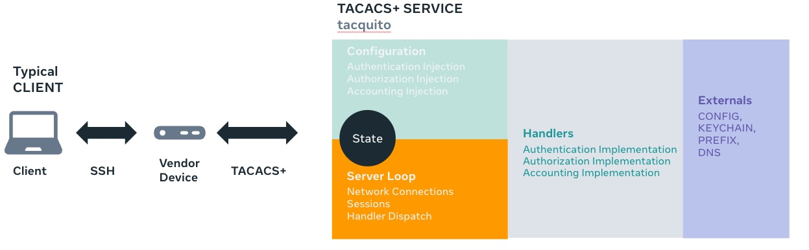

# Tacquito - An RFC8907 TACACS+ Implementation

Tacquito provides an [rfc8907](https://tools.ietf.org/html/rfc8907) implementation of TACACS+.  This package is primarily a module that implements the TACACS+ protocol and can be used to build TACACS+ servers and clients.  We provide a reference implementation of a client and a server but you are encouraged to experiment and replace core components of the system.  The tacquito package is designed with dependency injection at its core. Many of the core types are interfaces and may be replaced with differing implementations as needed. We support middleware through the Handler interface, similar in nature to how the http package does with handlers.

# Quick Start

You can easily start a server using the example yaml config by opening a shell in the server and client directories.  EG, you might have it in `/home/$USER/go/src/github.com/facebookincubator/tacquito`.

### Server
```
cd cmds/server && go run .
```
### Client
```
cd cmds/client && go . -username cisco -password cisco
```

Running the above will show a simple authentication exchange.

# Overview
The tacquito package is meant to be used as a module to build on. The only concrete implementations that are of interest are in `server.go`
and the HandlerFunc/Handler types.  These are used to construct external interaction from the specific client or server implementations.  We offer an example server that could be used in production, with a few customizations for your environment.  The reference client is just an example that we use to test the server or other devices.  We patterned the handlers after common approaches seen in other services such as the http package, using a Handler interface or a HandlerFunc.

Tacquito is split up in the following way:
* tacquito/ - the base package.  Our example server, client, handlers, etc etc, all are built on this package. Consider this the core package.  All other code can be injected, discarded and rewritten, etc. Changes to core code are typically breaking changes, whereas changes to handlers, etc are isolated to themselves and any downstream code that depends on it.
* tacquito/cmds/client - a default client implementation.
* tacquito/cmds/server/ - a default server implementation.
* tacquito/cmds/server/config - config holds the config parsing code and the different handler types that implement the three "A"s, Authentication, Authorization and Accounting.
* tacquito/cmds/server/config/authenticators/ - we provided a bcrypt authenticator handler as an example
* tacquito/cmds/server/config/authorizers/ - we provided our default "stringy" authorization handler.  It supports command and service based authorization.
* tacquito/cmds/server/config/accounters/ - local and syslog accounter handlers
* tacquito/cmds/server/config/secret/ - a dns and prefix (rfc compliant) secret providers.
* tacquito/cmds/server/exporter/ - prometheus stat exporter
* tacquito/cmds/server/handlers/ - the default handlers we use to process AAA packets.  We support most of the flows for each packet type. The start and span handler live here.
* tacquito/cmds/server/loader/ - this is where the different config loader implementations exist.  We provided yaml, json, and an fsnotify wrapper to pickup local changes.
* tacquito/cmds/server/test/ - tests specific to the reference server implementation.  There are several other tests sprinkled around the codebase and relatively exhaustive tests for the base tacquito package as well.  See tacquito/ for details.
* tacquito/proxy/ - provides an implementation for haproxy PROXY ASCII.  This is not provided in the server implementation in main.go, but could be injected if desired.
* tacquito/**/ - other directories that you should explore.  Most provide a dependency injection for some aspect of the server or config.

## cmds/client
The client folder holds a reference example for a client.  It is not an exhaustive implementation, simply illustrative.

## cmds/server
The server folder holds several additional subpackages, but this is a design decision we made for ourselves that allows us to use the oss code and provide injected, private implementations specific to Meta.  You are encouraged to make any implementation that suits your needs in the server itself or the config or secret packages.  This is meant to serve as an example only.

## cmds/server/config
The config package contains authenticators, authorizers, accounters, and secret provider subpackages. The config package also contains the user/group types that form our
relationship with configuration consumption.  See `types.go` in particular for unmarshalling details.  We provide YAML and JSON as the default formats but the concrete types in `types.go` can be composed into any other config formats desired.  We also encourage iteration on these formats and welcome PR requests to support additional, purposeful format additions.

## cmds/server/loader
The loader package contains the implementation details for consuming and unmarshalling config files in JSON and YAML. Additionally, it includes an fsnotify wrapper to detect changes in the config file and automatically trigger a reload of the config.  This means you do not need to restart your server if you change your config.  Only valid configs will be applied.  Invalid configs will end up being no-ops or get loaded to a best effort if they pass the unmarshalling code.  Take care to not drop valid traffic from bad configurations, it's quite easy to do.  Validation code around custom configs is strongly encouraged for this reason and we provide no examples, but these are easy to construct and could be provided in your own loader implementation.

## server.go
The `server.go` file holds the state machine that processes the HandlerFunc/Handler types.  Our code doc strings serve as our primary documentation source which you are strongly encouraged to read.

# Configuration
Tacquito does not read or support config formats that you'd traditionally see in other tacacs+ implementations.  We adhere in intent to these formats but represent the ideas in a different way.  As such, the way we compose and evaluate the config is different as well.  We have chosen this to allow for more flexibility when writing config and more deterministic behavior when we match on a config item.  The composition of independent config items are explained in the following sections.  All of these can be replaced via injection with your own implementations, even the format of the incoming config, if desired.

## SecretProviders
An ordered list of SecretConfigs.  Each SecretConfig is evaluated as first match, first win. SecretConfigs are a significant branch from the normal prefix matching process in other tacacs implementations where a client is matched against a key using their address.  We allow for any implementation to exist here and provide a few examples of ip address matching and dns.  It's possible to construct even more complicated lookups that reference external systems. Allowing this matching deviates from the RFC but the deviations are server side only and transparent to the client.  The client is unaware entirely.  You're welcome to stick with the RFC provider types (prefix) if you wish, but feel free to explore other forms.  When doing so, be mindful that SecretProviders are in the hot code path for incoming client connections and utmost care should be given when implementing behaviors.

### SecretConfigs
Defines how the server will group client devices or even a single device depending on how the SecretConfig is designed.

* name - must be globally unique in config. this is the "scope" to which users are associated to.
* secret - the secret keychain implementation to use.  You have group and key in the example implementation but could be changed to anything required.
* handler - this is the first handler accepted clients land on; typically START.  SPAN is also available or you are welcome to create your own.
* type - the type of secret provider to use.  Examples include DNS or PREFIX.
* options - a map[str,str] of free form options.  Providers typically need extra hints about what to use or how to bootstrap themselves.  Exmaple use is found in DNS and PREFIX.

### Keychain
Defines what group and optionally what key to use when interacting with Keychain.  Keychain defines what PSK to use within the tacas protocol.  We only provide trivial implemenations for these and you should definitely consider how to securely store/retrieve your secrets in a provider that meets your needs.

### Handler
Defines what handler the server will use to service the matching connection that the SecretConfig matched against.  The handler is usually Start or Span, depending on your config.  Take special care when reviewing the Span handler.

### Key Takeaway
The ordered list of SecretConfigs which form our SecretProvider list define how we communicate with a device; the PSK to use, the potential clients accept provider (dns, prefix, etc), and the initial handler.  The name of the provider is the "scope" used on the users.  First match wins.

## Users
Defines a username within a system. The user object defines the scope a user is a member of and optionally includes services, commands, authenticators and accounters.  If any of these items are done at thet user level, they are explicit overrides from any inherited groups.

* name - the username with the system.  usernames need not be globally unique, but they must be unique per scope.
* scope - the unique name of a SecretConfig to associate this user to.
* groups - the groups that this user will inherit from.
* services - services to allow. used only when you want to override values inherited from groups.
* commands - commands to allow. used only when you want to override values inherited from groups.
* authenticator - the authenticator provider type to use. used only when you want to override values inherited from groups.
* accounter - the authenticator provider type to use. used only when you want to override values inherited from groups.

### Key Takeaway
User config is core to tacquitos implementation. When config is loaded, we compose this down to individual user settings.  Any directives associated to the user override any conflicting directives obtained from the groups.  Usernames need only be unique within the scopes that they are used in.  Said differently, all configuration is ultimately applied on the user either through inheritance from groups or via overrides on the user object.  The config at this point should be considered user level only as it gets loaded into the associated SecretProvider.  If other injected code then manipulates this user object within that scope, the changes are constrained there, allowing for extremely precise changes and preventing unintended propagation to different scopes.


## Groups
Associate services, commands, authenticators, accounters for reuse.  These are secondary to any competing concepts found on the user level.

### Service
Defines an interaction attribute-value-pair for events that need service based authorization (aka session based in the rfc)

* name - a globally unique name for a service
* match - attribute-value-pairs provided from the client that will we match against.  If we match all conditions completely, we will use the service for a given request.
* set_values - defines the return attribute-value-pairs that we will send back to the client under a match condition.

### Key Takeaway
Services are used for session-based authorization.  It is essential to understand the rfc and the potential complexity of competing vendor requirements/expectations for service based flows.

## Command
Defines an interaction attribute-value-pair for events from clients requesting command based authorization.

* name - a globally unique name for a command
* action - permit or deny
* match - attribute-value-pairs provided by the client.  We must fully match to qualify.

### Key Takeaway
Command is the simplest form of authorization flows.  The avps we match on are based on regex patterns. First match wins.

## Authenticator
Simply, how we authenticate users.  We provide a Bcrypt authenticator as an example.

## Authorizer
Injectable only from main.go - no config knobs exist for this.

## Accounter
Simply, how you log accounting data to your respective backend.  This could be a log file, or something more complex.

### Key Takeaway
All three A(s) are optional.  There is no RFC requirement that authentication occurs on the same system that authorization, nor accounting does.  Even enable requests do not demand a previous authentication or authorization.  Assume nothing in terms of AAA state when running more than one instance of this service.  Failing to provide an implementation for one of the A(s) will result in a default deny to the client.

# Service Architecture Overview
Tacquito is designed with dependency injection at its heart.  Whenever we had the option to allow for something to be injected, we did so.  This created a service that was very flexible, but at the cost of increased complexity in terms of how it pulled everything together.  Ultimately, this created an extremely flexible service that can easily pivot internal requirements to create a main binary that can run under any environment and not risk breaking any other dependencies should some be removed or replaced.  Keep dependency injection in mind when considering the layout.

<p align="center">
   
</p>

## Configuration
Provides authentication, authorization and accounting injection points.  YAML is recommended, but JSON and other formats would also work with a custom loader implementation (also injectable). All dependencies here must be injected in main via their respective registration functions.  Missing dependencies will receive default implementations.  Bad configuration will be verbosely logged and rejected but will not stop processing of the rest of the config.  A sample YAML config can be found [here](cmds/server/tacquito.yaml).

## Server Loop
The server loop is implemented in the main tacquito package.  All connection management occurs in github.com/facebookincubator/tacquito/server.go.  A private session manager implementation is enforced here and is one of the rare examples of something we did not expose to dependency injection.  All handlers are called from this loop.

## Handlers
Handlers are everywhere.  They can be middleware and anything in between a client accept, response or disconnect.  handlers may be implemented as higher order functions or implement the handler interface.  All handlers are replaceable, wrapable or removable via dependency injection.


Interface:
```go
Handle(response tq.Response, request tq.Request)
```
Higher Order Function:
```go
tq.HandlerFunc(
    func(response tq.Response, request tq.Request)
)
```
## Externals
Externals represent systems or files that the server depends on for config or decision making.  You're limited only by your own implementations of these concepts.


## Notes on testing
We have many tests, but not all are extensive enough to capture all scenarios.  We believe we have tested the rfc related fields and flows quite well, but testing is one of those things that can always be improved on.

## Contributing
See the [CONTRIBUTING](CONTRIBUTING.md) file for how to help out.

## License
Tacquito is MIT licensed, as found in the LICENSE file.
